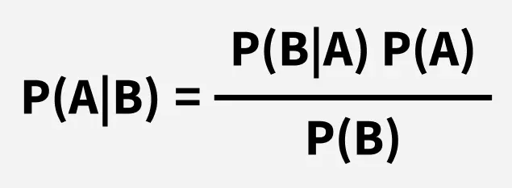

# 📚 2주차 TIL (Today I Learned)

### 1. 오늘 배운 개념 / 주제
  - 머신러닝의 기본 학습 방식
    - 지도학습(Supervised Learning)
    - 비지도학습(Unsupervised Learning)
    - 강화학습(Reinforcement Learning)
  - 데이터 전처리 및 모델 일반화 문제
    - 과대적합(Overfitting)
    - 과소적합(Underfitting)
    - 훈련 데이터/테스트 데이터 분리
  - 대표적인 머신러닝 알고리즘
    - 회귀 모델
    - 분류 모델
    - 군집 및 차원 축소 모델

### 2. 핵심 내용 요약
  1. 머신러닝의 3가지 학습 방식
     - 지도학습
       - 입력(X)과 정답(y)이 함께 주어짐
       - 목표 : 새로운 데이터에 대한 예측
       - 예 : 회귀, 분류
     - 비지도학습
       - 정답 없이 데이터의 구조를 스스로 학습
       - 목표 : 패턴 발견, 군집화
       - 예 : K-Means, PCA
     - 강화학습
       - 보상을 기반으로 최적의 행동 학습
       - 에이전트가 환경과 상호작용하며 학습 
  2. 데이터 전처리 & 모델 문제
     - 과대적합
       - 훈련 데이터에만 너무 잘 맞고, 새로운 데이터에는 성능 저하
       - 해결 방법 : 데이터 증가, 정규화, 모델 단순화
     - 과소적합
       - 모델이 너무 단순해서 패턴을 제대로 학습하지 못함
     - 데이터셋 구성
       - Train/Test 분리 필수
       - 일반적으로 7:3 또는 8:2 비율 사용
  3. 대표적인 지도학습 모델
     - 회귀
       - KNN
         - 가까운 이웃 데이터를 기반으로 한 예측
       - 선형회귀
         - 직선 형태로 데이터 관계 모델링
         - 비용 함수 최소화를 위해 경사하강법(Gradient Descent)사용
       - 다중회귀
         - 여러 개의 독립변수를 사용하는 회귀
     - 분류
       - 로지스틱 회귀
         - 확률 기반 분류 모델
         - 출력값을 0~1로 변환하는 시그모이드 함수 사용
       - SGD Classifier
         - 데이터 하나씩 보면서 업데이트 → 빠른 학습 가능
       - 나이브 베이즈
         - 확률 기반 모델, 조건부 독립 가정
         - 베이즈 정리를 이용해 특정 데이터가 특정 클래스에 속할 확률을 계산
      
         
         
         - P(A|B): 데이터(B)가 주어졌을 때 클래스(A)일 확률
       - 결정 트리
         - 질문을 통해 데이터를 분기
       - 랜덤 포레스트
         - 여러 결정 트리를 결합 (앙상블 기법)
       - XGBoost
         - Gradient Boosting 기반 고성능 모델
  4. 대표적인 비지도학습 모델
     - K-Means
       - 데이터를 K개의 군집으로 분류
     - PCA(주성분 분석)
       - 데이터의 차원 축소 → 정보는 유지하면서 변수 수 감소

### 3. 실습 / 과제 결과물

### 4. 느낀 점 / 배운 점 / 다음 목표
  - 머신러닝에서는 모델보다 데이터의 질과 전처리가 성능을 좌우한다는 점이 중요하다는것을 알게 되었다.
  - 지도학습, 비지도학습의 차이와 함께 과대적합을 어떻게 제어하느냐가 실제 모델 성능에 중요한 영향을 미친다는 것을 배웠다.
  - 앞으로 데이터 전처리 시 데이터의 특성과 분포를 먼저 파악하고, 하이퍼파라미터 튜닝과 모델 성능 개선을 함께 고려하는 방향으로 학습해야겠다.
